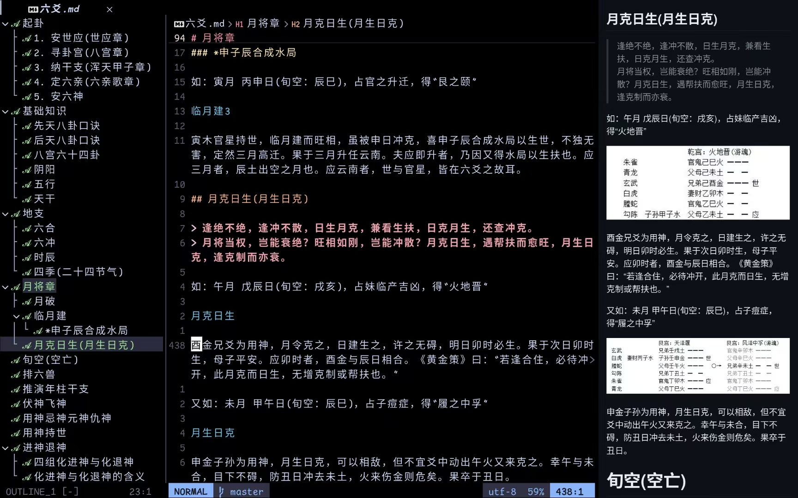

> [!IMPORTANT]
> 本人是colemak键位用户

可以用下面命令来更新插件：(不指定插件名默认更新全部)

* `:PackUpdate` 弹出界面让你审查，按 `:w` 确认
* `:PackUpdate!` 跳过界面，直接后台拉取并更新

某些插件需要安装特定的软件才能正常使用，如果是arch用户可以使用`paru`或者`yay`安装，示例如下

```bash
paru -S neovim python-neovim tree-sitter-cli xclip xsel wl-clipboard
# 如果使用kitty，则不需要安装下面的ueberzugpp等软件(用于图像预览)
paru -S lua51 imagemagick luarocks ueberzugpp
sudo luarocks --lua-version=5.1 install magick
# deno用于markdown预览插件编译，webkit2gtk-4.1可选
paru -S deno webkit2gtk-4.1
# translate-shell用于翻译，我配置的翻译快捷键是tr和ts
paru -S translate-shell
```

 
